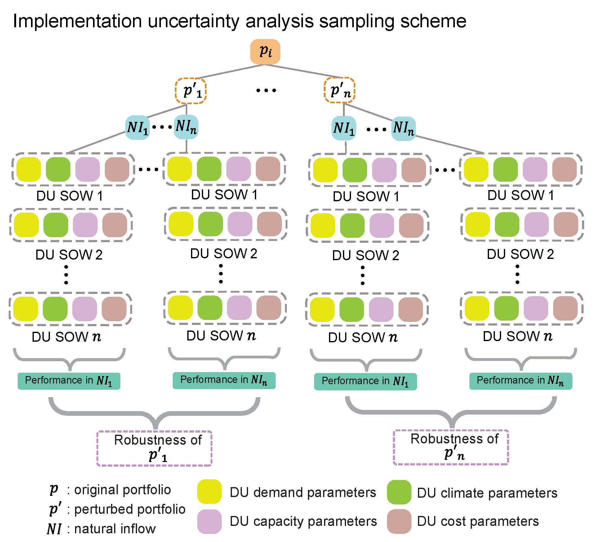

# Lau et al. (2022) WRR 
**Discovering Safe Operating Spaces in Deeply Uncertain Pathways: Evaluating How Implementation Uncertainties Shape Cooperative Multi-City Water Supply Portfolio Management and Investment**

Lillian B. Lau<sup>1,*</sup>, Patrick M. Reed<sup>1</sup>, David F. Gold<sup>1</sup>

<sup>1</sup>Department of Civil and Environmental Engineering, Cornell University, Ithaca, NY, USA

*corresponding author: lbl59@cornell.edu

## :memo: Cite us!
To cite this paper, please use the following citation 
```
TBA
```

## :white_check_mark: Replicate our experiments and recreate our figures 
This GitHub repository contains the code and data needed to replicate the computational experiments and recreate all figures for Lau et al. (2022). Note that this experiment was run using high performance computing and cannot easily be replicated on a personal computer.

*Note: All filepaths in the code files provided should be modified to reflect current individual data and information locations. Only one bootstrapped realization is provided due to memory constraints. Please contact the corresponding author at lbl59@cornell.edu for full set of realizations.*

## :floppy_disk: Contributing software 
|  Software/Model  |  Version  |  Clone the repo  |  DOI  | 
| ---------------- | --------- | ---------------- |------ |
| WaterPaths | NA | https://github.com/bernardoct/WaterPaths.git | doi.org/10.1016/j.envsoft.2020.104772 |
| MOEAFramework | 3.2 | http://moeaframework.org/downloads.html | NA |

## :file_folder: Folders 
- `bootstrapping` Contains all code required to bootstrap the full set of 1000 DU SOWs.
- `bootstrapped_reals` Contains one bootstrapped DU SOW.
- `du_reeval` Contains all code and scripts required to run DU Re-Evaluation
- `figure_generation` Contains all python code files used for generating figures
- `Figures` Contains all figures included in the paper. Only Figures 5 to 13 are generated using the files in `process_output`.
- `IU_Samples` Contains all code and files necessary to generate compromise solution perturbations.
- `Makefile` The WaterPaths Makefile
- `post_processing` Contains all python code files used for post-processing the output of the DU Re-Evaluation
- rof_table_generation Contains all code and scripts required to generate ROF Tables
- `src` Contains all the files necessary to build WaterPaths
- `TestFiles` Contains the CSV files required to run DU Re-Evaluation

## :hammer: Setup 
### Download and compile WaterPaths
1. Clone this repository and unzip all files. In the command line, enter the directory where this repository is stored. 
2. Type `make gcc` into the command line to compile WaterPaths.
3. Refresh the directory. Confirm that the `waterpaths` file is created.
4. Identify the location of the `implementation-uncertainty/bootstrapped_reals/` directory and copy its filepath.
5. Navigate to the `PaperTestProblem.cpp` file in the `implementation-uncertainty/src/Problem/` directory.
6. On Line 825, paste the filepath copied in Step 4 to replace all the contents in the quotation marks prior to `rdm_` 

### Download and install MOEAFramework
1. Select 'Source Code' to download the [MOEAFramework](http://moeaframework.org/downloads.html) directory onto your personal machine.
2. Unzip the file and locate the `MOEAFramework-2.13-Demo.jar` file. Change the version number (2.13) to the latest number if relevant.
3. Copy and paste the `.jar` file into the `IU_Samples/` directory.

## :mag: Implementation Uncertainty Analysis 
The figure below illustrates implementation uncertainty sampling scheme.
<p align="center">

</p>

### Generate samples for a perturbed solution
1. Navigate to the `IU_Samples/` directory and open the `generateSolutionSamples.sh` file in a text editor. 
2. Change the filename on Line 7 to the relevant file containing the implementation uncertainty sampling ranges for a compromise solution. 
3. Change the filenames on Line 8 and 9 to the desired filenames that will contain the sampled decision variable values for a compromise solution. 
4. Enter `./generateSolutionSamples.sh` into the command line to generate perturbed versions of the compromise solution.

### Generate ROF tables for bootstrapped realizations
1. Navigate to `implementation-uncertainty/rof_table_generation/` via the command line and create a new directory called `rof_tables_duReeval`.
2. Create a new folder called `out_du`.
3. In the `rof_tables_du_reeval.py` file, change information in Lines 20 to 24 to suit your machine specifications and number of available processors.
4. Change the information in Lines 26 and 27 to reflect the current filepath of the repository and the name of the CSV file containing the perturbed versions of a compromise solution.
5. Enter `./rof_tables_du.sh` into the command line to generate the ROF tables for the compromise solution.
6. All ROF tables can be found in the `rof_tables_duReeval/` directory.

### Re-evaluate perturbed compromise solution under deep uncertainty
1. Navigate to `implementation-uncertainty/du_reeval/` via the command line and create a new directory called `rof_tables_duReeval`.
2. Create two new folders called `out_du` and `output`.
3. In the `du_reeval_script.py` file, change information in Lines 18, 24 and 25 to suit your machine specifications and number of available processors.
4. Change the filenames on Line 20 and 22 to the desired filenames that will contain the sampled decision variable values for a compromise solution. 
5. Enter `./du_reeval_submission.sh` into the command line to generate the ROF tables for the compromise solution.
6. Tthe objective values of all perturbed versions of the compromise solution can be found in the `output/` directory.
*Note: Rename the `output/` directory before resubmitting the `du_reeval_submission.sh` file to re-evaluate another compromise solution.*

## :gear: Post-process the results for figure generation 
Create a new folder in the main `implementation-uncertainty/` directory named according to the current compromise solution (LS98 or PW113).

### Gather and organize objective values for the original and perturbed versions of a compromise solution
1. Navigate to the `implementation-uncertainty/post_processing/` directory and open the `gather_objs.py` file. 
2. Change lines 124 and 125 to reflect the compromise solution being analyzed.
3. Change lines 129 to 147 to reflect the input and output filepaths of the objective files, and the compromise solution being analyzed. 

### Calculate robustness of each perturbed instance
1. Navigate to the `implementation-uncertainty/post_processing/` directory and open the `calc_robustness_across_rdms.py` file. 
2. Change lines 183, 184 and  and 198 to reflect the compromise solution being analyzed.
3. Change lines 186 to 194 to reflect the input and output filepaths of the robustness files, and the compromise solution being analyzed. 

### Identify the least-robust perturbed instance
1. Navigate to the `implementation-uncertainty/post_processing/` directory and open the `worst_robustness_indv.py` file. 
2. Change lines 130 and 131 to reflect the compromise solution being analyzed.
3. Change lines 133 to 147 to reflect the objectives and robustness files, and the compromise solution being analyzed.

## :bar_chart: Reproduce figures 
1. Navigate to the `implementation-uncertainty/figure_generation/` directory.
2. Execute each code file to generate its corresponding figure in the `Figures/` directory.


