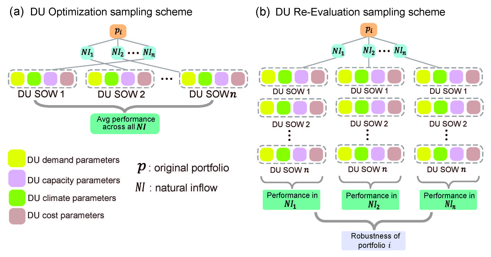

# Lau et al. (2022) Implementation Uncertainty
This GitHub repository contains the code and data needed to recreate all figures and replicate the computation experiments for Lau et al. (2022). 

To recreate all figures, run the Python scripts within the `figure_generation` directory. Data from Trindade et al. (2020) can be found in the `results` directory. 

To replicate the cmoputational experiment, follow the steps outlined below. Note that this experiment was run using high performance computing and cannot easily be replicated on a personal computer. To accurately replicate the experiment, please use parallel master-worker version of [Borg MOEA](http://borgmoea.org). You can request access to the source code [here](http://borgmoea.org/#contact).

## Folders :file_folder:
1. `src`: Contains all the files necessary to build WaterPaths
2. `process_output`: Contains all python code files used for post-processing the output of the DU Reevaluation
3. `figure_generation`: Contains all python code files used for generating figures
4. `Figures`: Contains all figures included in the paper. Only Figures 5 to 13 are generated using the files in `process_output`.

## Setup :hammer:
1. Clone this repository and unzip all files. In the command line, enter the directory where this repository is stored. 
2. Type `make gcc` into the command line to compile WaterPaths.

## DU Optimization and Re-Evaluation :dart:
The figure below illustrates (a) the DU Optimization and (b) DU Re-Evaluation sampling scheme.

## Implementation Uncertainty Analysis :mag:
The figure below illustrates implementation uncertainty sampling scheme.

### Generate the implementation uncertainty sampling range

### Bootstrap analysis

### Generate ROF tables for bootstrapped realizations

